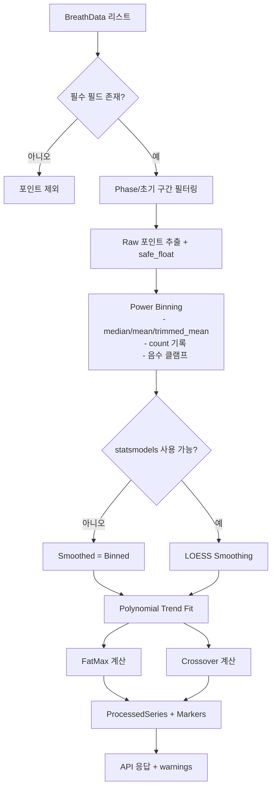

# 대사 프로파일 분석 시스템 설계 문서

> 버전: 1.0  
> 작성일: 2026-01-16  
> 상태: 구현 완료 (정제 데이터셋 파이프라인 설계 보강)

---

## 1. 개요

CPET(심폐운동부하검사) 데이터에서 대사 프로파일을 분석하여 지방 연소율, 탄수화물 산화율, FATMAX, VO2MAX, 환기역치(VT1/VT2) 등을 추출하는 시스템.

### 1.1 목표
- Raw CPET 데이터(COSMED K5 Excel)에서 대사 지표 자동 계산
- 운동 단계(Rest → Warmup → Main → Recovery) 자동 감지
- 환기역치(Ventilatory Threshold) 자동 감지
- 시각화를 위한 차트 데이터 생성

### 1.2 아키텍처

```
┌─────────────────┐     ┌──────────────────┐     ┌─────────────────┐
│  COSMED Excel   │────▶│  cosmed_parser   │────▶│   BreathData    │
│     (.xlsx)     │     │    Service       │     │     Model       │
└─────────────────┘     └──────────────────┘     └─────────────────┘
                                │
                                ▼
                        ┌──────────────────┐
                        │   Phase/VT       │
                        │   Detection      │
                        └──────────────────┘
                                │
                                ▼
                        ┌──────────────────┐
                        │  Preprocess &   │
                        │  Interpolate    │
                        └──────────────────┘
                            │
                            ▼
                        ┌──────────────────┐
                        │ ProcessedSeries │
                        │   (Chart-ready) │
                        └──────────────────┘
                            │
                            ▼
┌─────────────────┐     ┌──────────────────┐     ┌─────────────────┐
│   Frontend      │◀────│  test.py         │◀────│   CPETTest      │
│   Charts        │     │  Service         │     │     Model       │
└─────────────────┘     └──────────────────┘     └─────────────────┘
```

---

## 2. 핵심 알고리즘

### 2.1 대사율 계산 (Frayn 공식)

호흡가스 분석 데이터에서 지방과 탄수화물 산화율을 계산:

```python
# Frayn 공식 (g/min)
fat_oxidation = 1.67 × VO₂ - 1.67 × VCO₂
cho_oxidation = 4.55 × VCO₂ - 3.21 × VO₂

# 칼로리 변환 (kcal/min)
fat_kcal = fat_oxidation × 9.0
cho_kcal = cho_oxidation × 4.0
```

**참고 문헌**: Frayn KN (1983). Calculation of substrate oxidation rates in vivo from gaseous exchange.

### 2.2 운동 단계 감지 (Phase Detection)

파워 기반으로 운동의 단계를 자동 감지:

```python
def detect_phases(breath_data: list) -> list[str]:
    """
    단계 감지 전략:
    1. 파워(W) 데이터 사용 (우선)
    2. 심박수(HR) 데이터 사용 (폴백)
    """
    phases = []
    
    for row in breath_data:
        power = row.power or 0
        
        if power < 20:
            phase = 'rest'
        elif power < 50:
            phase = 'warmup'
        elif power >= previous_power:  # 증가 추세
            phase = 'main'
        else:
            phase = 'recovery'
        
        phases.append(phase)
    
    return smooth_phase_transitions(phases)
```

**단계 정의**:

| 단계 | 조건 | 설명 |
|------|------|------|
| Rest | Power < 20W | 안정 상태 |
| Warmup | 20W ≤ Power < 50W | 준비 운동 |
| Main | Power ≥ 50W, 증가 추세 | 본 운동 (Ramp) |
| Recovery | Power 감소 추세 | 회복 |

### 2.3 환기역치 감지 (VT Detection)

세 가지 방법으로 VT1/VT2를 감지:

#### 2.3.1 V-Slope 방법 (기본)

VCO₂ vs VO₂ 그래프에서 기울기 변화점 감지:

```python
def detect_vt_v_slope(breath_data: list) -> dict:
    """
    V-Slope 방법:
    - VT1: VCO₂/VO₂ 기울기가 1.0을 초과하는 지점
    - VT2: 기울기가 급격히 증가하는 지점 (RCP)
    """
    vo2_values = [d.vo2 for d in breath_data]
    vco2_values = [d.vco2 for d in breath_data]
    
    # 누적 합계로 smoothing
    cumsum_vo2 = cumsum(vo2_values)
    cumsum_vco2 = cumsum(vco2_values)
    
    # 기울기 변화 감지
    for i in range(window, len(data) - window):
        slope_before = calculate_slope(cumsum_vco2[:i], cumsum_vo2[:i])
        slope_after = calculate_slope(cumsum_vco2[i:], cumsum_vo2[i:])
        
        if slope_after / slope_before > threshold:
            vt1_index = i
            break
    
    return {
        'vt1': {'index': vt1_index, 'vo2': vo2[vt1_index], 'hr': hr[vt1_index]},
        'vt2': {'index': vt2_index, 'vo2': vo2[vt2_index], 'hr': hr[vt2_index]}
    }
```

#### 2.3.2 환기당량 방법

VE/VO₂와 VE/VCO₂의 최저점 감지:

```python
def detect_vt_ventilatory_equivalent(breath_data: list) -> dict:
    """
    환기당량 방법:
    - VT1: VE/VO₂의 최저점 (VE/VCO₂는 아직 안정)
    - VT2: VE/VCO₂가 상승하기 시작하는 지점
    """
    ve_vo2 = [d.ve / d.vo2 for d in breath_data]
    ve_vco2 = [d.ve / d.vco2 for d in breath_data]
    
    vt1_index = find_nadir(ve_vo2)  # 최저점
    vt2_index = find_inflection_point(ve_vco2)  # 변곡점
```

#### 2.3.3 RER 방법 (간편)

호흡교환율 기반 간단한 감지:

```python
def detect_vt_rer(breath_data: list) -> dict:
    """
    RER 방법:
    - VT1: RER = 0.85 도달 지점
    - VT2: RER = 1.0 도달 지점
    """
    for i, d in enumerate(breath_data):
        rer = d.vco2 / d.vo2
        if rer >= 0.85 and vt1_index is None:
            vt1_index = i
        if rer >= 1.0 and vt2_index is None:
            vt2_index = i
```

### 2.4 FATMAX 감지

지방 산화율이 최대인 운동 강도:

```python
def find_fatmax(breath_data: list) -> dict:
    """
    FATMAX 계산:
    - Main 단계에서 fat_oxidation_rate가 최대인 지점
    - 해당 시점의 Power, HR, VO₂ 반환
    """
    main_phase_data = [d for d in breath_data if d.phase == 'main']
    
    max_fat_idx = argmax([d.fat_oxidation_rate for d in main_phase_data])
    fatmax_point = main_phase_data[max_fat_idx]
    
    return {
        'fat_max': fatmax_point.fat_oxidation_rate,  # g/min
        'power': fatmax_point.power,                  # W
        'hr': fatmax_point.hr,                        # bpm
        'vo2': fatmax_point.vo2,                      # ml/min
        'vo2_percent': fatmax_point.vo2 / vo2_max * 100
    }
```

### 2.5 VO2MAX 감지

최대 산소섭취량:

```python
def find_vo2max(breath_data: list) -> dict:
    """
    VO2MAX 계산:
    - 전체 테스트에서 VO₂의 최대값
    - 해당 시점의 Power, HR 반환
    """
    max_vo2_idx = argmax([d.vo2 for d in breath_data])
    vo2max_point = breath_data[max_vo2_idx]
    
    return {
        'vo2_max': vo2max_point.vo2,      # ml/min
        'power': vo2max_point.power,       # W
        'hr': vo2max_point.hr,             # bpm
        'rer': vo2max_point.vco2 / vo2max_point.vo2
    }
```

---

## 3. API 설계

### 3.1 분석 엔드포인트

```
GET /api/tests/{test_id}/analysis
```

**응답 구조**:

```json
{
  "test_id": "uuid",
  "test_type": "ramp",
  "analysis_date": "2026-01-16T12:00:00Z",
  
  "phase_boundaries": {
    "rest": {"start_index": 0, "end_index": 30},
    "warmup": {"start_index": 31, "end_index": 60},
    "main": {"start_index": 61, "end_index": 180},
    "recovery": {"start_index": 181, "end_index": 210}
  },
  
  "phase_metrics": {
    "rest": {

---

## 4. API 설계
      "avg_rer": 0.78,
      "avg_fat_oxidation": 0.32,
      "avg_cho_oxidation": 0.45
    },
    "main": {
      "avg_hr": 145,
      "avg_vo2": 1850,
      "peak_vo2": 2100,
      "avg_rer": 0.92,
      "avg_fat_oxidation": 0.48,
      "peak_fat_oxidation": 0.65
    }
  },
  
  "fatmax_info": {
    "fat_max": 0.654,
    "power": 58.5,
    "hr": 126,
    "vo2": 1245,
    "vo2_percent": 58.2
  },
  
  "vo2max_info": {
    "vo2_max": 2140,
    "power": 185,
    "hr": 178,
    "rer": 1.15
  },
  
  "ventilatory_thresholds": {
    "vt1": {
      "index": 85,
      "vo2": 1450,
      "hr": 135,
      "power": 95,
      "detection_method": "v_slope"
    },
    "vt2": {
      "index": 142,
      "vo2": 1890,
      "hr": 165,
      "power": 145,
      "detection_method": "v_slope"
    }
  },
  
  "chart_data": [
    {
      "time": 0,
      "power": 0,
      "hr": 72,
      "vo2": 280,
      "vco2": 220,
      "rer": 0.78,
      "fat_oxidation": 0.32,
      "cho_oxidation": 0.45,
      "phase": "rest"
    }
  ]
}
```

---

## 4. 전처리 알고리즘 (현재 구현)

> 구현 위치: backend/app/services/metabolism_analysis.py

### 4.1 입력 데이터 스펙
- 필수: `bike_power`, `fat_oxidation`, `cho_oxidation`
- 옵션: `rer`, `vo2`, `vco2`, `hr`, `ve_vo2`, `ve_vco2`, `t_sec`, `phase`

### 4.2 처리 순서 (요약)
1. Phase/초기 구간 필터링
2. Raw 포인트 추출 및 값 정리
3. Power Binning (집계)
4. LOESS Smoothing
5. Polynomial Trend Fit (옵션 트렌드)
6. FatMax & Crossover 마커 계산
7. 결과 패키징 + 경고 기록

### 4.3 단계별 목적 및 상세

#### 4.3.1 Phase/초기 구간 필터링
**목적**: 분석 대상에서 비운동 구간과 초기 과호흡 구간을 제거하여 신뢰도 확보.

- Rest/Warm-up/Recovery 제외 옵션
- 초기 과호흡 필터링
    - `t_sec < initial_time_threshold` AND `bike_power < initial_power_threshold`이면 제외
- `min_power_threshold`, `max_power_threshold`로 파워 범위 제한

#### 4.3.2 Raw 포인트 추출 및 값 정리
**목적**: 입력 데이터의 결측/비정상 값을 안전하게 처리하여 이후 집계가 깨지지 않도록 보장.

- 각 필드에 대해 `safe_float` 적용
- `NaN`/`Inf`는 `None`으로 치환
- 필요한 필드가 없으면 해당 포인트 스킵

#### 4.3.3 Power Binning (집계)
**목적**: 호흡-호흡 변동을 완화하고 강도별 대표값을 얻기 위한 단계.

- `power_bin = round(power / bin_size) * bin_size`
- 집계 방식 선택:
    - `median` (기본)
    - `mean`
    - `trimmed_mean` (양쪽 비율 절삭 평균)
- `count` 저장 → 데이터 신뢰도 표현
- 산화율 값 음수는 `0`으로 클램핑 (`non_negative_constraint`)

#### 4.3.4 LOESS Smoothing
**목적**: binning된 데이터의 국소 변동을 더 매끄럽게 보정.

- statsmodels의 `lowess` 사용
- 데이터가 적거나 statsmodels 미설치 시 binned 데이터 그대로 사용
- `loess_frac` 자동 하한 0.15 적용
- RER/VO2/VCO2/HR/VE 관련 값은 충분한 유효 포인트가 있을 때만 스무딩

#### 4.3.5 Polynomial Trend Fit (옵션 트렌드)
**목적**: 생리학적 패턴에 맞춘 안정적인 트렌드 곡선 제공.

- Fat/CHO: 3차 (역 U 또는 J 패턴)
- RER: 3차
- VO2/VCO2/HR/VE: 2차
- 10W 간격의 trend 포인트 생성

#### 4.3.6 FatMax & Crossover 계산
**목적**: 대사 해석의 핵심 지점을 도출.

- **FatMax**: smoothed fat oxidation 최대 지점
- **Zone**: MFO의 `fatmax_zone_threshold` 이상 유지 구간
- **Crossover**: smoothed fat = cho 교차점 (선형 보간)

### 4.4 다이어그램 (Pipeline)



### 4.5 실패/경고 처리
- 데이터가 부족하면 경고 메시지 기록 후 `None` 또는 부분 결과 반환
- LOESS 실패 시 binned 데이터로 자동 폴백

---

## 5. 파일 구조

```
backend/app/
├── services/
│   ├── cosmed_parser.py    # COSMED 파싱 + 대사율 계산
│   │   ├── parse_excel()           # Excel 파싱
│   │   ├── calculate_metabolism()  # Frayn 공식
│   │   ├── detect_phases()         # 단계 감지
│   │   ├── detect_ventilatory_thresholds()  # VT 감지
│   │   ├── get_phase_boundaries()  # 단계 경계
│   │   └── calculate_phase_metrics()  # 단계별 지표
│   │
│   └── test.py             # 테스트 비즈니스 로직
│       ├── upload_and_parse()      # 업로드 처리
│       └── get_analysis()          # 분석 데이터 반환
│
├── api/
│   └── tests.py            # API 라우트
│       └── GET /tests/{id}/analysis
│
├── models/
│   └── cpet_test.py        # CPETTest 모델
│       └── phase_metrics: JSON     # 단계별 지표 저장
│
└── schemas/
    └── test.py             # Pydantic 스키마
        ├── TestAnalysisResponse
        ├── PhaseInfo
        ├── PhaseBoundaries
        ├── PhaseMetrics
        ├── FatMaxInfo
        ├── VO2MaxInfo
        └── MetabolismDataPoint

frontend/src/
├── lib/
│   └── api.ts              # API 클라이언트
│       └── getTestAnalysis()
│
└── components/pages/
    └── MetabolismPage.tsx  # 대사 프로파일 시각화
        └── transformAnalysisToChartData()
```

---

## 6. 데이터 흐름

### 6.1 업로드 시

```
Excel Upload
    │
    ▼
cosmed_parser.parse_excel()
    │
    ▼
calculate_metabolism()  ─────┐
    │                        │
    ▼                        ▼
detect_phases()         detect_ventilatory_thresholds()
    │                        │
    ▼                        ▼
BreathData Records      CPETTest.phase_metrics
(TimescaleDB)           (JSON Column)
```

### 6.2 분석 조회 시

```
GET /tests/{id}/analysis
    │
    ▼
TestService.get_analysis()
    │
    ├─▶ Load BreathData from DB
    │
    ├─▶ get_phase_boundaries()
    │
    ├─▶ calculate_phase_metrics()
    │
    ├─▶ find_fatmax_info()
    │
    ├─▶ find_vo2max_info()
    │
    └─▶ downsample_for_chart()
            │
            ▼
    TestAnalysisResponse (JSON)
```

---

## 6. 테스트 결과

### 6.1 단위 테스트 (8개 통과)

```
tests/test_metabolism_analysis.py
├── test_fat_oxidation_calculation      ✓
├── test_cho_oxidation_calculation      ✓
├── test_detect_phases_basic            ✓
├── test_detect_phases_hr_fallback      ✓
├── test_detect_vt_v_slope              ✓
├── test_phase_boundaries               ✓
├── test_phase_metrics                  ✓
└── test_fatmax_detection               ✓
```

### 6.2 실제 데이터 검증

**테스트 파일**: `Hong Changsun 20241119 CPET Ramp_20241119131037.xlsx`

| 지표 | 측정값 | 단위 |
|------|--------|------|
| FATMAX | 0.654 | g/min |
| FATMAX Power | 58.5 | W |
| FATMAX HR | 126 | bpm |
| VO2MAX | 1693 | ml/min |
| VT1 HR | 126 | bpm |
| VT2 HR | 148 | bpm |

---

## 7. 향후 개선 사항

### 7.1 알고리즘 개선
- [ ] VT 감지 정확도 향상 (기계학습 적용)
- [ ] 다중 VT 감지 방법 앙상블
- [ ] Crossover Point 계산 추가

### 7.2 기능 확장
- [ ] PDF 리포트 생성
- [ ] 테스트 간 비교 분석
- [ ] 트레이닝 존(Zone) 자동 계산
- [ ] 시계열 트렌드 분석

### 7.3 최적화
- [ ] 대용량 데이터 스트리밍 처리
- [ ] Redis 캐싱 적용
- [ ] 차트 데이터 사전 계산

---

## 8. 참고 문헌

1. Frayn KN (1983). Calculation of substrate oxidation rates in vivo from gaseous exchange. J Appl Physiol.
2. Jeukendrup AE, Wallis GA (2005). Measurement of substrate oxidation during exercise by means of gas exchange measurements. Int J Sports Med.
3. Beaver WL, Wasserman K, Whipp BJ (1986). A new method for detecting anaerobic threshold by gas exchange. J Appl Physiol.
4. Meyer T, Lucia A, Earnest CP, Kindermann W (2005). A conceptual framework for performance diagnosis and training prescription. Med Sci Sports Exerc.
